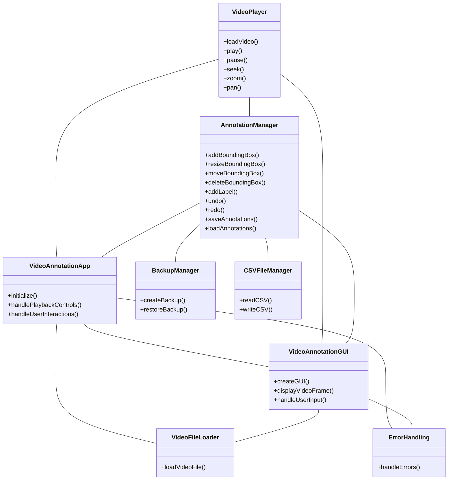

```mermaid
classDiagram
    class VideoPlayer {
        +loadVideo()
        +play()
        +pause()
        +seek()
        +zoom()
        +pan()
    }

    class AnnotationManager {
        +addBoundingBox()
        +resizeBoundingBox()
        +moveBoundingBox()
        +deleteBoundingBox()
        +addLabel()
        +undo()
        +redo()
        +saveAnnotations()
        +loadAnnotations()
    }

    class VideoAnnotationApp {
        +initialize()
        +handlePlaybackControls()
        +handleUserInteractions()
    }

    class BackupManager {
        +createBackup()
        +restoreBackup()
    }

    class VideoFileLoader {
        +loadVideoFile()
    }

    class CSVFileManager {
        +readCSV()
        +writeCSV()
    }

    class VideoAnnotationGUI {
        +createGUI()
        +displayVideoFrame()
        +handleUserInput()
    }

    class ErrorHandling {
        +handleErrors()
    }

    VideoPlayer -- AnnotationManager
    VideoPlayer -- VideoAnnotationApp
    AnnotationManager -- VideoAnnotationApp
    AnnotationManager -- BackupManager
    AnnotationManager -- CSVFileManager
    VideoAnnotationApp -- VideoFileLoader
    VideoAnnotationApp -- VideoAnnotationGUI
    VideoAnnotationApp -- ErrorHandling
    VideoAnnotationGUI -- VideoPlayer
    VideoAnnotationGUI -- AnnotationManager
    VideoAnnotationGUI -- VideoFileLoader
    VideoAnnotationGUI -- ErrorHandling
```
